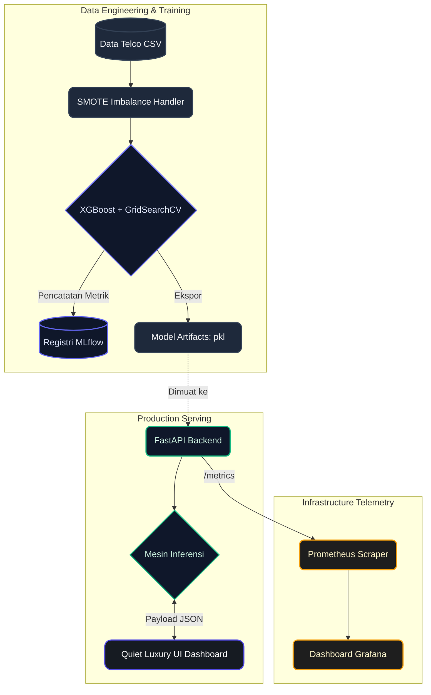

<div align="center">

🌍 Read this in: [English](README.md) | [Bahasa Indonesia](README.id.md)

<br>
  
# 🚀 Enterprise MLOps: Telecommunications Churn & LTV Prediction
*Sebuah pipeline Machine Learning Operations (MLOps) yang dapat diskalakan dari ujung ke ujung (end-to-end) dengan Web Dashboard bergaya Quiet Luxury.*

[](https://www.python.org/)
[](https://xgboost.ai/)
[](https://fastapi.tiangolo.com/)
[](https://www.docker.com/)
[](https://mlflow.org/)
[](https://grafana.com/)
[](https://github.com/features/actions)

</div>

---

## 📑 Daftar Isi
- [Ringkasan Eksekutif](#-ringkasan-eksekutif)
- [Alur Arsitektur Sistem](#-alur-arsitektur-sistem)
- [Visual Showcase & Kapabilitas](#-visual-showcase--kapabilitas)
- [Alur Kerja MLOps Step-by-Step](#-alur-kerja-mlops-step-by-step)
- [Panduan Memulai Cepat](#-panduan-memulai-cepat)
- [Struktur Direktori Proyek](#-struktur-direktori-proyek)

---

## 💼 Ringkasan Eksekutif

Kehilangan pelanggan (*customer churn*) merugikan industri telekomunikasi miliaran dolar setiap tahunnya. Proyek ini direkayasa sebagai **Solusi Enterprise Siap Produksi** yang ditargetkan langsung pada *Revenue Protection* (Perlindungan Pendapatan) dan Mitigasi Risiko.

Dengan mengintegrasikan **Algoritma XGBoost** yang disetel secara presisi bersama **SMOTE (Synthetic Minority Over-sampling Technique)**, mesin AI ini secara dinamis menghitung Probabilitas Churn dan memprediksi **Estimasi Kerugian Pendapatan (LTV)** secara seketika (*real-time*). Seluruh infrastruktur dikontainerisasi menggunakan Docker dan dipantau menggunakan telemetri standar industri (Prometheus & Grafana), menjadikannya prototipe SaaS yang sangat tangguh, mudah diskalakan, dan siap dipresentasikan kepada investor.

---

## 🏗️ Alur Arsitektur Sistem

Pipeline ini sangat terpisah (*decoupled*), memastikan bahwa eksperimen *Data Science* terisolasi dari proses penyajian API dan Telemetri.



---

## ✨ Visual Showcase & Kapabilitas

<div align="center">
  <table style="width:100%; text-align:center;">
    <tr>
      <td width="50%">
        <b>1. The Executive Dashboard (Status Siap)</b><br><br>
        <i>Antarmuka utama bergaya "Quiet Luxury" yang menanti input data profil pelanggan.</i><br>
        
      </td>
      <td width="50%">
        <b>2. High-Risk Churn Detection</b><br><br>
        <i>Deteksi otomatis pelanggan berisiko tinggi beserta proyeksi kerugian pendapatan (LTV Loss).</i><br>
        
      </td>
    </tr>
    <tr>
      <td width="50%">
        <b>3. Safe / Loyal Customer Assessment</b><br><br>
        <i>Evaluasi pelanggan dengan tingkat retensi tinggi yang diproyeksikan stabil.</i><br>
        
      </td>
      <td width="50%">
        <b>4. Explainable AI (SHAP Impact)</b><br><br>
        <i>Grafik SHAP Impact yang memberikan transparansi alasan matematis di balik prediksi AI.</i><br>
        
      </td>
    </tr>
    <tr>
      <td width="50%">
        <b>5. Executive Retention Queue</b><br><br>
        <i>Notifikasi interaktif saat eksekutif menekan tombol mitigasi pada antrean akun berisiko.</i><br>
        
      </td>
      <td width="50%">
        <b>6. REST API Documentation</b><br><br>
        <i>Dokumentasi API otomatis (Swagger) untuk melayani proses inferensi dengan latensi rendah.</i><br>
        
      </td>
    </tr>
    <tr>
      <td width="50%">
        <b>7. Real-Time Telemetry</b><br><br>
        <i>Dashboard Grafana yang memvisualisasikan metrik infrastruktur secara real-time.</i><br>
        
      </td>
      <td width="50%">
        <b>8. Experiment Tracking</b><br><br>
        <i>Tracking performa AI secara otomatis dan komparasi model XGBoost menggunakan antarmuka MLflow.</i><br>
        
      </td>
    </tr>
  </table>
</div>

---

## ⚙️ Alur Kerja MLOps Step-by-Step

Proyek ini tidak sekadar menghasilkan prediksi, melainkan mematuhi siklus hidup *Machine Learning* yang matang dan tersandardisasi.

| Tahap | Proses yang Dieksekusi | Teknologi Inti |
| :--- | :--- | :--- |
| **1. Data Preprocessing** | Pembersihan data, pemetaan kamus `O(1)` untuk latensi rendah, One-Hot Encoding. | `pandas`, `scikit-learn` |
| **2. Resampling & Balancing** | Mengimplementasikan SMOTE untuk meningkatkan sensitivitas AI terhadap deteksi ancaman kelas minoritas (Churn). | `imbalanced-learn` |
| **3. Model Training** | Pelatihan **XGBoost Classifier** dan **CoxPHFitter** (Survival Analysis untuk sisa Tenure). | `xgboost`, `lifelines` |
| **4. Experiment Tracking** | Secara otomatis merekam Hyperparameter, accuracy, f1-score, dan menyimpan artifak model (`.pkl`). | `mlflow` |
| **5. Continuous Integration** | Otomatisasi proses Linting (Flake8) dan Pengujian (Pytest) melalui GitHub Actions setiap ada perubahan kode. | `GitHub Actions` |
| **6. Containerized Deployment** | Backend FastAPI menyajikan model dan antarmuka (UI) di dalam kontainer docker yang terisolasi penuh. | `Docker`, `Docker Compose` |

---

## 🚀 Panduan Memulai Cepat

Proses *deploy* (penerapan) seluruh infrastruktur (Model, API, UI, dan Telemetri) di mesin lokal Anda sangat ringkas.

### Prasyarat
- [Python 3.10+](https://www.python.org/downloads/)
- [Docker & Docker Compose](https://www.docker.com/products/docker-desktop/)

### Langkah 1: Inisialisasi Environment & Training
Pertama, instal dependensi lokal dan latih algoritma XGBoost untuk menghasilkan artifak `.pkl`.
```bash
# Instal seluruh dependensi
pip install -r requirements.txt

# Jalankan skrip training
python src/train.py
```

### Langkah 2: Menjalankan Enterprise Stack (Docker)
Setelah model berhasil dilatih, bangun dan jalankan seluruh arsitektur *microservices*.
```bash
docker-compose up --build -d
```

### Langkah 3: Akses Platform
Tunggu beberapa detik hingga seluruh kontainer berjalan stabil, kemudian buka tautan berikut di browser Anda:
- 💎 **Web Dashboard (UI):** [http://localhost:8000](http://localhost:8000)
- ⚙️ **FastAPI Swagger:** [http://localhost:8000/docs](http://localhost:8000/docs)
- 📈 **Grafana Monitoring:** [http://localhost:3000](http://localhost:3000) (Login: `admin` / `admin`)
- 🧪 **Experiment Tracking (MLflow):** 
  - Windows: Jalankan `$env:MLFLOW_ALLOW_FILE_STORE="true"; python -m mlflow ui` di terminal PowerShell.
  - Mac/Linux: Jalankan `MLFLOW_ALLOW_FILE_STORE=true python -m mlflow ui` di terminal.
  - Lalu buka [http://localhost:5000](http://localhost:5000)

---

## 📁 Struktur Direktori Proyek

```text
mlops-churn-dicoding/
├── .github/workflows/       # Pipeline CI/CD otomatis (Linting & Pytest)
├── app/
│   ├── main.py              # Server FastAPI (Inferensi & Serving File Statis)
│   ├── models_schemas.py    # Skema validasi input Pydantic
│   └── static/              
│       └── index.html       # UI Enterprise Dashboard "Quiet Luxury"
├── assets/                  # Kumpulan gambar visualisasi untuk Repositori
├── data/                    # Direktori dataset (CSV)
├── models/                  # Artifak hasil pelatihan model (.pkl)
├── monitoring/
│   ├── grafana/             # Konfigurasi penyediaan dashboard Grafana
│   └── prometheus/          # Skrip scraping Prometheus
├── src/
│   ├── preprocess.py        # Logika pipeline transformasi data
│   └── train.py             # Skrip inti pelatihan XGBoost, SMOTE, dan MLflow
├── docker-compose.yml       # Orkestrasi multi-container
├── Dockerfile               # Skrip pembangunan container image FastAPI
└── requirements.txt         # Daftar spesifikasi versi library Python
```

---

<div align="center">
  <i>Diarsiteki untuk melampaui standar industri sebagai pemenuhan Sertifikasi "Membangun Sistem Machine Learning" Dicoding.</i>
</div>
