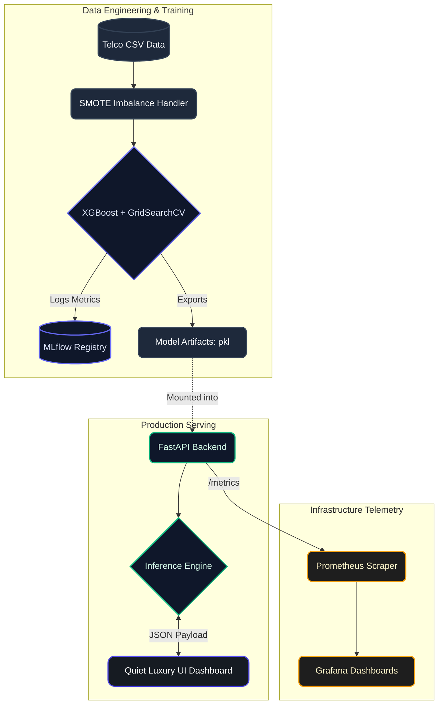
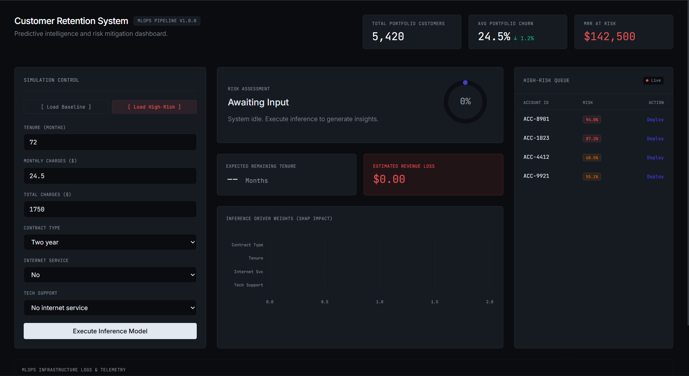

⭐ If you find this repository helpful, please consider giving it a star!

<div align="center">

🌍 Read this in: [English](README.md) | [Bahasa Indonesia](README.id.md)

<br>
  
# 🚀 Enterprise MLOps: Telecommunications Churn & LTV Prediction
*A scalable, end-to-end Machine Learning Operations pipeline with a Quiet Luxury Web Dashboard.*

[](https://www.python.org/)
[](https://xgboost.ai/)
[](https://fastapi.tiangolo.com/)
[](https://www.docker.com/)
[](https://mlflow.org/)
[](https://grafana.com/)
[](https://github.com/features/actions)

</div>

---

## 📑 Table of Contents
- [Executive Summary](#-executive-summary)
- [System Architecture Flow](#-system-architecture-flow)
- [Visual Showcase & Capabilities](#-visual-showcase--capabilities)
- [MLOps Workflow Step-by-Step](#-mlops-workflow-step-by-step)
- [Quick Start Guide](#-quick-start-guide)
- [Project Directory Structure](#-project-directory-structure)

---

## 💼 Executive Summary

Customer churn costs the telecommunications industry billions of dollars annually. This project is engineered as a **Production-Ready Enterprise Solution** aimed directly at *Revenue Protection* and *Risk Mitigation*. 

By integrating a finely tuned **XGBoost Algorithm** with **SMOTE (Synthetic Minority Over-sampling Technique)**, this AI engine dynamically calculates Churn Probability and predicts **Estimated Revenue Loss (LTV)** in real-time. The infrastructure is entirely containerized (Docker) and monitored using industry-standard telemetry (Prometheus & Grafana), making it a highly robust, scalable, and investor-ready SaaS prototype.

---

## 📊 Dataset & Business Context

The AI engine in this project is trained on the **Telco Customer Churn Dataset** (a widely recognized synthetic dataset from IBM). 
- **The Data:** It contains 7,043 customer profiles, including demographics, account information (Tenure, Contract Type, Payment Method), and subscribed services.
- **The Problem:** The dataset is highly imbalanced (only ~26% of customers actually churned).
- **The Solution:** The pipeline utilizes SMOTE to balance the training data, allowing the XGBoost model to accurately recognize the minority class (churners) without overfitting.

During live inference, the Web Dashboard simulates a real-time entry of these customer features by a Business Executive.

---

## 🏗️ System Architecture Flow

The pipeline is highly decoupled, ensuring that Data Science experimentation is separate from API serving and Telemetry. 



---

## ✨ Visual Showcase & Capabilities

<div align="center">
  <table style="width:100%; text-align:center;">
    <tr>
      <td width="50%" valign="top">
        <b>1. The Executive Dashboard (Idle State)</b><br><br>
        <i>A "Quiet Luxury" style main interface awaiting customer profile data input.</i><br>
        
      </td>
      <td width="50%" valign="top">
        <b>2. High-Risk Churn Detection</b><br><br>
        <i>Automated high-risk customer detection with projected revenue loss (LTV Loss).</i><br>
        
      </td>
    </tr>
    <tr>
      <td width="50%" valign="top">
        <b>3. Safe / Loyal Customer Assessment</b><br><br>
        <i>Evaluation of a customer with a high projected retention rate.</i><br>
        
      </td>
      <td width="50%" valign="top">
        <b>4. Explainable AI (SHAP Impact)</b><br><br>
        <i>SHAP Impact charts providing mathematical transparency behind every AI prediction.</i><br>
        
      </td>
    </tr>
    <tr>
      <td width="50%" valign="top">
        <b>5. Executive Retention Queue</b><br><br>
        <i>Interactive Toast Notification triggered when an executive deploys a mitigation action.</i><br>
        
      </td>
      <td width="50%" valign="top">
        <b>6. REST API Documentation</b><br><br>
        <i>Automated interactive API Documentation (Swagger) for low-latency inference serving.</i><br>
        
      </td>
    </tr>
    <tr>
      <td width="50%" valign="top">
        <b>7. Real-Time Telemetry</b><br><br>
        <i>Grafana Dashboard visualizing Prometheus infrastructure metrics in real-time.</i><br>
        
      </td>
      <td width="50%" valign="top">
        <b>8. Experiment Tracking</b><br><br>
        <i>Automated AI performance tracking and XGBoost model comparison using MLflow UI.</i><br>
        
      </td>
    </tr>
  </table>
</div>

---

## ⚙️ MLOps Workflow Step-by-Step

This project strictly adheres to a mature Machine Learning Lifecycle.

| Phase | Process Executed | Core Technology |
| :--- | :--- | :--- |
| **1. Data Preprocessing** | Data cleaning, `O(1)` dictionary mapping for low latency, One-Hot Encoding. | `pandas`, `scikit-learn` |
| **2. Resampling & Balancing** | Implementing SMOTE to sensitize the AI towards detecting minority class Churn threats. | `imbalanced-learn` |
| **3. Model Training** | Training **XGBoost Classifier** and **CoxPHFitter** (Survival Analysis for remaining Tenure). | `xgboost`, `lifelines` |
| **4. Experiment Tracking** | Automatically logging Hyperparameters, accuracy, f1-score, and artifacts (`.pkl`). | `mlflow` |
| **5. Continuous Integration** | Automated Linting (Flake8) and Testing (Pytest) pipelines via GitHub Actions on every commit. | `GitHub Actions` |
| **6. Containerized Deployment** | FastAPI backend serving the model and UI within fully isolated docker containers. | `Docker`, `Docker Compose` |

---

## 🚀 Quick Start Guide

Deploying the entire infrastructure (Model, API, UI, and Telemetry) on your local machine is highly streamlined.

### Prerequisites
- [Python 3.10+](https://www.python.org/downloads/)
- [Docker & Docker Compose](https://www.docker.com/products/docker-desktop/)

### Step 1: Initialize Environment & Training
First, install the local dependencies and train the XGBoost algorithm to generate the `.pkl` artifact.
```bash
# Install dependencies
pip install -r requirements.txt

# Run the training script
python src/train.py
```

### Step 2: Launch the Enterprise Stack (Docker)
Once the model is trained, build and spin up the entire microservices architecture.
```bash
docker-compose up --build -d
```

### Step 3: Access the Platforms
Wait a few seconds for the containers to fully start, then visit the following links in your browser:
- 💎 **Web Dashboard (UI):** [http://localhost:8000](http://localhost:8000)
- ⚙️ **FastAPI Swagger:** [http://localhost:8000/docs](http://localhost:8000/docs)
- 📈 **Grafana Monitoring:** [http://localhost:3000](http://localhost:3000) (Login: `admin` / `admin`)
- 🧪 **Experiment Tracking (MLflow):** 
  - Windows: Run `$env:MLFLOW_ALLOW_FILE_STORE="true"; python -m mlflow ui` in PowerShell.
  - Mac/Linux: Run `MLFLOW_ALLOW_FILE_STORE=true python -m mlflow ui` in terminal.
  - Then visit [http://localhost:5000](http://localhost:5000)

---

## 📁 Project Directory Structure

```text
mlops-churn-dicoding/
├── .github/workflows/       # Automated CI/CD pipeline (Linting & Pytest)
├── app/
│   ├── main.py              # FastAPI server (Inference & Static File Serving)
│   ├── models_schemas.py    # Pydantic input validation schemas
│   └── static/              
│       └── index.html       # "Quiet Luxury" UI Enterprise Dashboard
├── assets/                  # Repository visualization images
├── data/                    # Dataset directory (CSV)
├── models/                  # Generated training artifacts (.pkl)
├── monitoring/
│   ├── grafana/             # Grafana dashboard provisioning
│   └── prometheus/          # Prometheus scraping scripts
├── src/
│   ├── preprocess.py        # Data transformation pipeline logic
│   └── train.py             # Core XGBoost, SMOTE, and MLflow script
├── docker-compose.yml       # Multi-container orchestration
├── Dockerfile               # FastAPI image build script
└── requirements.txt         # Python library version specifications
```

---

<div align="center">
  <i>Architected to exceed industry standards for the Dicoding "Membangun Sistem Machine Learning" Certification.</i>
</div>
