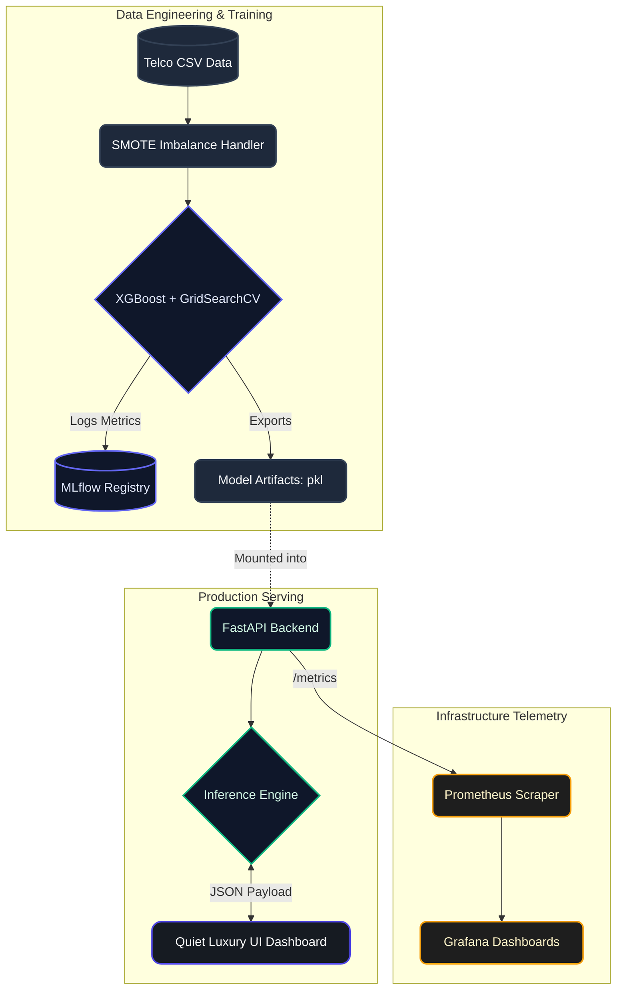

<div align="center">
  
# 🚀 Enterprise MLOps: Telecommunications Churn & LTV Prediction
*A scalable, end-to-end Machine Learning Operations pipeline with a Quiet Luxury Web Dashboard.*

[](https://www.python.org/)
[](https://xgboost.ai/)
[](https://fastapi.tiangolo.com/)
[](https://www.docker.com/)
[](https://mlflow.org/)
[](https://grafana.com/)
[](https://github.com/features/actions)

</div>

---

## 📑 Table of Contents

- [Executive Summary](#-executive-summary)
- [System Architecture Flow](#-system-architecture-flow)
- [Visual Showcase & Capabilities](#-visual-showcase--capabilities)
- [MLOps Workflow Step-by-Step](#-mlops-workflow-step-by-step)
- [Quick Start Guide](#-quick-start-guide)
- [Project Directory Structure](#-project-directory-structure)

---

## 💼 Executive Summary

Customer churn costs the telecommunications industry billions of dollars annually. This project is engineered as a **Production-Ready Enterprise Solution** aimed directly at _Revenue Protection_ and _Risk Mitigation_.

By integrating a finely tuned **XGBoost Algorithm** with **SMOTE (Synthetic Minority Over-sampling Technique)**, this AI engine dynamically calculates Churn Probability and predicts **Estimated Revenue Loss (LTV)** in real-time. The infrastructure is entirely containerized (Docker) and monitored using industry-standard telemetry (Prometheus & Grafana), making it a highly robust, scalable, and investor-ready SaaS prototype.

---

## 🏗️ System Architecture Flow

The pipeline is highly decoupled, ensuring that Data Science experimentation is separate from API serving and Telemetry.



---

## ✨ Visual Showcase & Capabilities


<div align="center">
  <table style="width:100%; text-align:center;">
    <tr>
      <td width="50%">
        <b>1. The Executive Dashboard (Idle State)</b><br><br>
        <i>Antarmuka utama bergaya "Quiet Luxury" yang menanti input data profil pelanggan.</i><br>
        
      </td>
      <td width="50%">
        <b>2. High-Risk Churn Detection</b><br><br>
        <i>Deteksi otomatis pelanggan berisiko tinggi beserta proyeksi kerugian pendapatan (LTV Loss).</i><br>
        
      </td>
    </tr>
    <tr>
      <td width="50%">
        <b>3. Safe / Loyal Customer Assessment</b><br><br>
        <i>Evaluasi pelanggan dengan tingkat retensi tinggi yang diproyeksikan stabil.</i><br>
        
      </td>
      <td width="50%">
        <b>4. Explainable AI (SHAP Impact)</b><br><br>
        <i>Grafik SHAP Impact yang memberikan transparansi alasan matematis di balik prediksi AI.</i><br>
        
      </td>
    </tr>
    <tr>
      <td width="50%">
        <b>5. Executive Retention Queue</b><br><br>
        <i>Notifikasi interaktif saat eksekutif menekan tombol mitigasi pada antrean akun berisiko.</i><br>
        
      </td>
      <td width="50%">
        <b>6. REST API Documentation</b><br><br>
        <i>Dokumentasi API otomatis (Swagger) untuk melayani proses inferensi dengan latensi rendah.</i><br>
        
      </td>
    </tr>
    <tr>
      <td width="50%">
        <b>7. Real-Time Telemetry</b><br><br>
        <i>Dashboard Grafana yang memvisualisasikan metrik infrastruktur secara real-time.</i><br>
        
      </td>
      <td width="50%">
        <b>8. Experiment Tracking</b><br><br>
        <i>Tracking metrik performa AI dan komparasi model XGBoost menggunakan antarmuka MLflow.</i><br>
        
      </td>
    </tr>
  </table>
</div>

---

## ⚙️ MLOps Workflow Step-by-Step

Proyek ini tidak hanya melakukan prediksi, tetapi mematuhi siklus hidup _Machine Learning_ yang matang.

| Tahap                           | Proses yang Berjalan                                                                                            | Teknologi                  |
| :------------------------------ | :-------------------------------------------------------------------------------------------------------------- | :------------------------- |
| **1. Data Preprocessing**       | Pembersihan data, pemetaan kamus `O(1)` untuk latensi rendah, _One-Hot Encoding_.                               | `pandas`, `scikit-learn`   |
| **2. Resampling & Balancing**   | Menggunakan teknik SMOTE agar AI lebih sensitif dalam mendeteksi ancaman _Churn_ di kelas minoritas.            | `imbalanced-learn`         |
| **3. Model Training**           | Pelatihan **XGBoost Classifier** dan **CoxPHFitter** (Survival Analysis untuk sisa _Tenure_).                   | `xgboost`, `lifelines`     |
| **4. Experiment Tracking**      | MLflow secara otomatis merekam _Hyperparameters_, akurasi, f1-score, dan model _artifacts_ (`.pkl`).            | `mlflow`                   |
| **5. Continuous Integration**   | Kode melewati proses otomatis _Linting_ (Flake8) dan _Testing_ (Pytest) via GitHub Actions setiap ada _Commit_. | `GitHub Actions`           |
| **6. Containerized Deployment** | _Backend_ FastAPI menyajikan model dan UI secara bersamaan di dalam kontainer yang saling terhubung.            | `Docker`, `Docker Compose` |

---

## 🚀 Quick Start Guide

Mendeploy seluruh arsitektur ini (Model, API, UI, dan Telemetri) di mesin lokal Anda sangatlah mudah.

### Prasyarat

- [Python 3.10+](https://www.python.org/downloads/)
- [Docker & Docker Compose](https://www.docker.com/products/docker-desktop/)

### Langkah 1: Inisialisasi Environment & Training

Pertama, kita siapkan pustaka lokal dan latih algoritma XGBoost untuk menghasilkan file `.pkl`.

```bash
# Install seluruh dependensi
pip install -r requirements.txt

# Jalankan skrip training
python src/train.py
```

### Langkah 2: Menjalankan Enterprise Stack (Docker)

Setelah model dilatih, bangun seluruh arsitektur layanan menggunakan Docker.

```bash
docker-compose up --build -d
```

### Langkah 3: Akses Platform

Tunggu beberapa detik hingga seluruh kontainer menyala, lalu akses tautan berikut di _browser_ Anda:

- 💎 **Web Dashboard (UI):** [http://localhost:8000](http://localhost:8000)
- ⚙️ **FastAPI Swagger:** [http://localhost:8000/docs](http://localhost:8000/docs)
- 📈 **Grafana Monitoring:** [http://localhost:3000](http://localhost:3000) (Login: `admin` / `admin`)
- 📊 **Prometheus Scraper:** [http://localhost:9090](http://localhost:9090)

---

## 📁 Project Directory Structure

```text
mlops-churn-dicoding/
├── .github/workflows/       # CI/CD pipeline otomatis (Linting & Pytest)
├── app/
│   ├── main.py              # FastAPI server (Inference & Static File Serving)
│   ├── models_schemas.py    # Skema validasi input Pydantic
│   └── static/
│       └── index.html       # "Quiet Luxury" UI Enterprise Dashboard
├── data/                    # Folder dataset (CSV)
├── models/                  # File hasil training (.pkl artifacts)
├── monitoring/
│   ├── grafana/             # Konfigurasi dashboard Grafana
│   └── prometheus/          # Skrip scraping Prometheus
├── src/
│   ├── preprocess.py        # Logika pipeline transformasi data
│   └── train.py             # Skrip utama XGBoost, SMOTE, MLflow
├── docker-compose.yml       # Orkestrasi multi-container
├── Dockerfile               # Skrip pembangunan image FastAPI
└── requirements.txt         # Daftar spesifikasi versi library Python
```

---

<div align="center">
  <i>Architected to exceed industry standards for the Dicoding "Membangun Sistem Machine Learning" Certification.</i>
</div>
