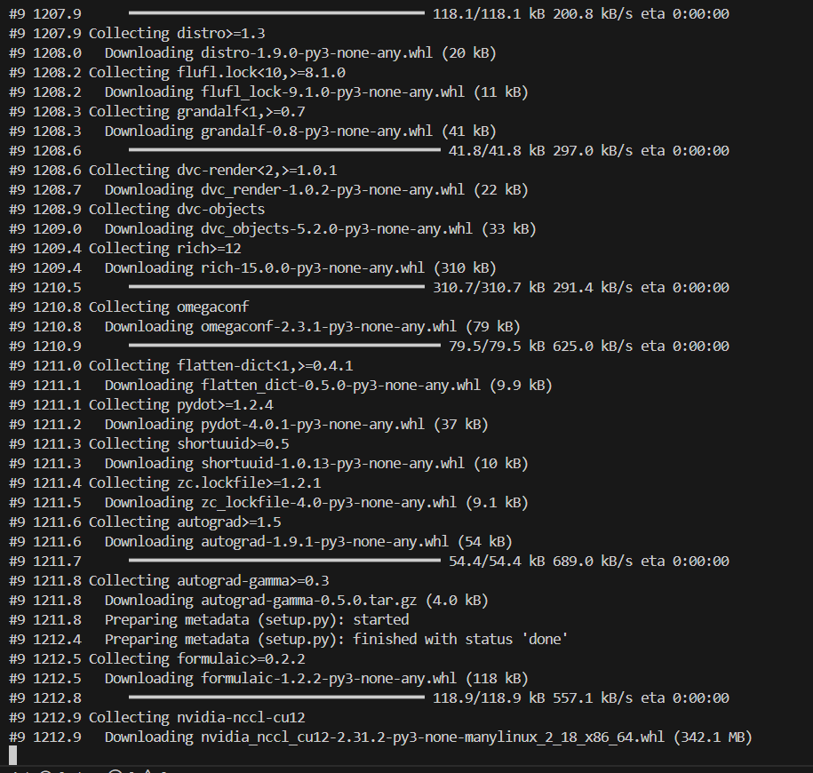
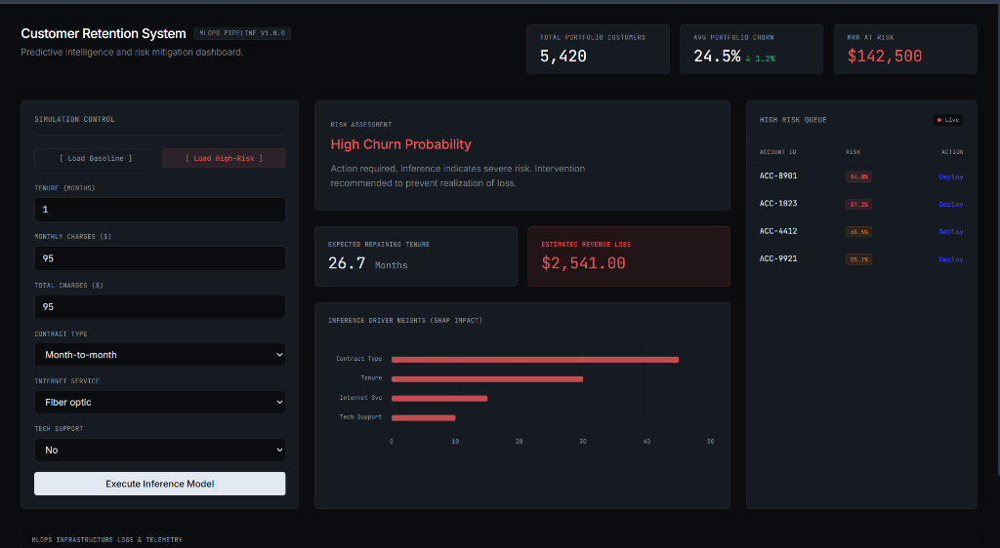

<div align="center">
  
# 🚀 Enterprise MLOps: Customer Retention & LTV Prediction
*A scalable, end-to-end Machine Learning Operations pipeline with a Quiet Luxury Web Dashboard.*

[](https://www.python.org/)
[](https://xgboost.ai/)
[](https://fastapi.tiangolo.com/)
[](https://www.docker.com/)
[](https://mlflow.org/)
[](https://grafana.com/)

</div>

---

## 💼 Executive Summary

Customer churn costs the telecommunications industry billions annually. This project is not just a theoretical data science model—it is a **Production-Ready Enterprise Dashboard** designed to directly address *Revenue Protection*. 

By integrating a finely tuned **XGBoost Algorithm** with **SMOTE (Synthetic Minority Over-sampling Technique)**, this AI engine dynamically calculates Churn Probability and predicts **Estimated Revenue Loss (LTV)** in real-time. The infrastructure is entirely containerized and monitored using industry-standard telemetry (Prometheus & Grafana), making it a highly robust, scalable, and investor-ready SaaS prototype.

---

## ✨ Visual Showcase: The "Quiet Luxury" Dashboard

Our user interface abandons generic templates in favor of a **High-Density Bento Grid System** inspired by leading SaaS platforms like *Stripe, Linear,* and *Vercel*.

<table>
  <tr>
    <td width="50%">
      <h3 align="center">📊 The Executive Dashboard (Idle State)</h3>
      <p align="center">
        
      </p>
      <p align="center"><i>Clean micro-typography, muted status colors, and a fully reactive UI powered by FastAPI serving static HTML.</i></p>
    </td>
    <td width="50%">
      <h3 align="center">🚨 High-Risk Churn Detection</h3>
      <p align="center">
        
      </p>
      <p align="center"><i>Interactive SHAP feature-importance charts (ApexCharts) explaining exactly <b>why</b> a customer is leaving.</i></p>
    </td>
  </tr>
</table>

---

## 🏗️ System Architecture & Data Flow

Our architecture follows a clean, highly decoupled MLOps philosophy:

🔹 **1. Data Engineering & Balancing** 
> Raw Telco Data ➔ `imbalanced-learn` (SMOTE) ➔ Balanced Training Set 

🔹 **2. Model Training & Tracking** 
> `XGBClassifier` + `GridSearchCV` ➔ `mlflow.autolog()` ➔ Best Model Registry (`model.pkl`)

🔹 **3. High-Performance Serving**
> `FastAPI` REST Endpoint ➔ Loads `XGBoost` & `CoxPHFitter` (Survival/LTV) ➔ Serves Inference

🔹 **4. Telemetry & Monitoring**
> FastAPI `prometheus-client` ➔ `Prometheus` Scraper ➔ `Grafana` Live Dashboard

---

## 🚀 Quick Start (Local Deployment)

Deploying the entire infrastructure (API, ML Model, UI, and Monitoring) only takes a few steps.

### 1. Initialize the AI Engine
Ensure you have the dependencies installed, then run the training pipeline to generate the XGBoost and Survival models.
```bash
pip install -r requirements.txt
python src/train.py
```
*(All experiments, parameters, and metrics are automatically tracked via MLflow)*

### 2. Launch the Enterprise Stack
Ensure Docker is running. The following command spins up the backend, the user interface, Prometheus, and Grafana simultaneously.
```bash
docker-compose up --build -d
```

### 3. Access the Platforms
- 💎 **Executive UI (Dashboard):** [http://localhost:8000](http://localhost:8000)
- ⚙️ **API Documentation (Swagger):** [http://localhost:8000/docs](http://localhost:8000/docs)
- 📈 **Grafana Telemetry:** [http://localhost:3000](http://localhost:3000) *(User/Pass: admin)*
- 🧪 **MLflow Tracking:** Run `python -m mlflow ui` and visit [http://localhost:5000](http://localhost:5000)

---

## 🛠️ Technology Stack Breakdown

| Layer | Technology | Purpose |
| :--- | :--- | :--- |
| **Frontend UI** | HTML5, TailwindCSS, ApexCharts | "Quiet Luxury" Dashboard and dynamic graphing |
| **Backend API** | FastAPI, Uvicorn | High-speed REST API for model inference |
| **Machine Learning**| XGBoost, Scikit-learn, Lifelines | Extreme Gradient Boosting, SMOTE, Survival Analysis (LTV) |
| **MLOps Pipeline** | MLflow, DVC | Automated experiment tracking and data versioning |
| **Containerization**| Docker, Docker Compose | Isolated, reproducible execution environments |
| **Monitoring** | Prometheus, Grafana | Real-time metric scraping and observability |

---

<div align="center">
  <i>Architected with ❤️ for the Dicoding "Membangun Sistem Machine Learning" Certification.</i>
</div>
